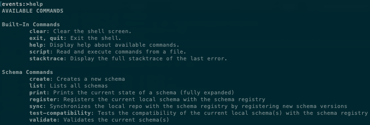

# Events (Events Repo, Sync Service, and CLI)

This project contains event schemas and a CLI for syncing schemas with schema registry. Its primary job is to hold an organization's event schemas for a data pipeline.

The event schemas are stored as [Avro IDL](https://avro.apache.org/docs/current/idl.html) and are located in the `schemas/` directory. Common sub-schemas, such as metadata which is included in all events, are stored in `schemas/common/` and imported by events to reduce duplicate code.

When changes are made to events and merged into master, the schemas are synchronized with the remote schema registry and compiled into language-specific libraries that engineers can use to publish and consume events.

## Creating or Modifying Schemas

You can update the schema files directly within the file system or use this codebase's interactive CLI to provide useful feedback while creating or modifying schemas.

### Running the events CLI

Requirements:
* Java 12+
* Gradle 5+

```sh
make cli             # Run locally
ENV=prod make cli    # Run against prod
```



- To see a list of the available commands within the CLI simply run `help`
- To get help for a specific command or see what options are available for it simply run `help {command name}` (e.g. `help create`).
- The CLI has auto-completion enabled. To use it simply hit the `tab` key. It is available for command completion, option completion on commands, 
and even for option value completion in some situations.


### Running a local schema registry

The docker compose file in this project will build and run a minimal version of the pipeline (kafka, zookeeper, schema registry) 
to enable schema registration, event production, and event consumption **locally**.

```sh
make registry   # Bring up a local schema registry with docker-compose and sync local schemas to it.
```

### Pull Request ➡ Validating, Syncing, Merging, Publishing

Once you've created or modified all of the schemas you need to, simply create a pull request in the git repo. Upon merge, all of 
the schemas in the local repo are:

* Validated (ensuring they conform to the Avro IDL protocol)
* Checked for compatibility with their existing state in the schema registry
* Synced with the remote schema registry (new schemas or versions of schemas are registered)
* Compiled into libraries for use in Typescript, PHP, and Java.

### Using events in your Projects

Once your schema updates have been merged and released you can pull in the latest packages/artifacts using 
your preferred dependency management tool.
